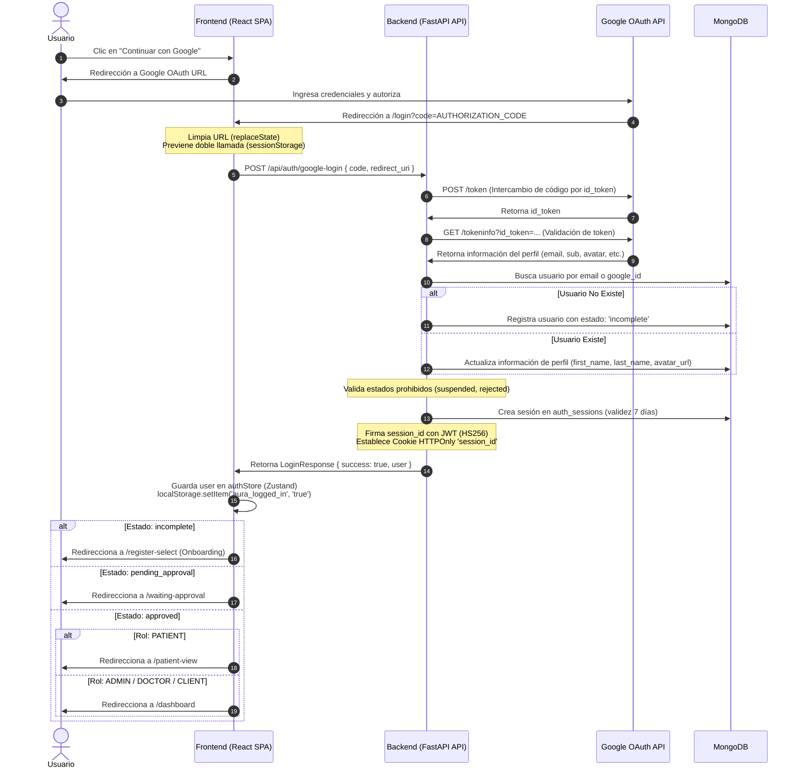

# Flujo de Autenticación y Login del Sistema

Este documento describe detallada y técnicamente el proceso de inicio de sesión (Login) implementado en el **Sistema de Telemonitorización de Signos Vitales**. El flujo utiliza **Google OAuth2** para la identidad federada y **Cookies de Sesión Stateful** cifradas/firmadas con JWT del lado del servidor para el mantenimiento de la sesión.

---

## 1. Arquitectura General y Flujo de Autenticación

El proceso combina una Single Page Application (SPA) construida en **React + TypeScript** con un servidor API asíncrono construido en **FastAPI (Python)** y **MongoDB** como base de datos documental.

El flujo sigue el siguiente patrón de alto nivel:



---

## 2. Detalle del Frontend (React + TypeScript)

### Componentes Clave
- **Vista de Login:** [LoginView.tsx](file:///c:/Users/Freddy/Desktop/Sistema%20de%20Telemonitorizacion%20de%20signos%20vitales/frontend/src/views/LoginView.tsx)
- **Store de Autenticación:** [authStore.ts](file:///c:/Users/Freddy/Desktop/Sistema%20de%20Telemonitorizacion%20de%20signos%20vitales/frontend/src/store/authStore.ts)
- **Instancia de Axios:** [api.ts](file:///c:/Users/Freddy/Desktop/Sistema%20de%20Telemonitorizacion%20de%20signos%20vitales/frontend/src/utils/api.ts)

### 2.1. Generación de la URL de Autorización de Google
El botón **"Continuar con Google"** apunta a la URL construida dinámicamente utilizando variables de entorno para el ID del cliente de Google y la ubicación actual como redirect URI:

```typescript
const clientId = import.meta.env.VITE_GOOGLE_CLIENT_ID || '';
const redirectUri = `${window.location.origin}/login`;
const params = new URLSearchParams({
  client_id: clientId,
  redirect_uri: redirectUri,
  response_type: 'code',
  scope: 'openid email profile',
  prompt: 'select_account',
});
const authUrl = `https://accounts.google.com/o/oauth2/v2/auth?${params.toString().replace(/\+/g, '%20')}`;
```

### 2.2. Mitigación del Comportamiento de React 18 StrictMode (Doble Render)
En desarrollo, React 18 en StrictMode renderiza los componentes de forma doble para detectar efectos secundarios. Dado que el código de Google OAuth es de **un solo uso**, si se enviase dos veces al backend, la segunda petición fallaría con un error de Google.

Para solucionar esto de manera síncrona e inmediata, `LoginView.tsx` implementa dos protecciones en su `useEffect`:
1. **Limpieza inmediata de la URL:** Ejecuta `window.history.replaceState` de forma síncrona para eliminar el `code` de la barra de direcciones.
2. **Registro de procesamiento en sessionStorage:** Guarda una bandera en `sessionStorage` que previene el reenvío del mismo código en renders subsiguientes:

```typescript
const code = searchParams.get('code');
if (code) {
  // Limpia la URL de inmediato para evitar re-evaluaciones en re-renders
  window.history.replaceState({}, document.title, window.location.pathname);

  // Prevenir la doble llamada asíncrona en desarrollo
  const processedCode = sessionStorage.getItem('processed_oauth_code');
  if (processedCode !== code) {
    sessionStorage.setItem('processed_oauth_code', code);
    
    // Llamar al Store de Zustand para iniciar sesión
    useAuthStore.getState().googleLogin(code, true)
      .then((res) => { ... })
      .catch((err) => { ... });
  }
}
```

### 2.3. Redirecciones según Estado de Cuenta del Usuario
Una vez que el backend responde con éxito, el frontend lee el campo `status` del usuario retornado para decidir el flujo de navegación:
- **`incomplete`:** El usuario se acaba de registrar mediante Google pero no ha completado el formulario de onboarding (selección de rol y datos profesionales/personales). Es redirigido a `/register-select`.
- **`pending_approval`:** El usuario completó el onboarding, pero su cuenta de personal médico (Doctor/Administrador/Cliente) aún debe ser evaluada y aprobada por un administrador del sistema. Redirigido a `/waiting-approval`.
- **`approved`:** Cuenta habilitada para operar.
  - Si el rol es `PATIENT` (Paciente), es redirigido a la vista de paciente en `/patient-view`.
  - Para otros roles (`ADMIN`, `DOCTOR`, `CLIENT`), se le redirige al panel administrativo central `/dashboard`.

---

## 3. Detalle del Backend (FastAPI)

### Componentes Clave
- **Rutas de Autenticación:** [auth.py](file:///c:/Users/Freddy/Desktop/Sistema%20de%20Telemonitorizacion%20de%20signos%20vitales/backend/routes/auth.py)
- **Utilidades de Criptografía:** [auth_utils.py](file:///c:/Users/Freddy/Desktop/Sistema%20de%20Telemonitorizacion%20de%20signos%20vitales/backend/services/auth_utils.py)
- **Modelos y Esquemas:** [user.py](file:///c:/Users/Freddy/Desktop/Sistema%20de%20Telemonitorizacion%20de%20signos%20vitales/backend/models/user.py)

### 3.1. Procesamiento en el Endpoint `/auth/google-login`
Cuando el backend recibe una petición `POST` en `/auth/google-login` con el `code` y la `redirect_uri`:

1. **Intercambio del Código por Token (`exchange_google_code_async`):**
   Realiza una petición asíncrona `POST` a `https://oauth2.googleapis.com/token` utilizando `httpx.AsyncClient` con parámetros como `client_id`, `client_secret` (extraídos de la configuración del sistema), `code`, `redirect_uri` y `grant_type: "authorization_code"`. Google devuelve un JSON que contiene un `id_token`.
   
2. **Validación del ID Token (`verify_google_id_token_async`):**
   Envía el `id_token` a la API de validación oficial de Google en `https://oauth2.googleapis.com/tokeninfo`. Esto verifica la firma criptográfica y expiración del token. Extrae la información esencial del perfil:
   - `email` (Dirección de correo electrónico)
   - `sub` (Identificador único de Google o Google ID)
   - `given_name` y `family_name` (Nombres y apellidos)
   - `picture` (URL de la imagen de avatar)
   
3. **Persistencia e Identificación del Usuario en MongoDB:**
   Realiza una búsqueda atómica en la colección `users` buscando coincidencias con `google_id` o `email`.
   - **Si no existe:** Registra al usuario asignándole un `_id` de tipo `ObjectId`, guardando los datos básicos del perfil y definiendo su estado (`status`) inicial en `incomplete` con el rol en `None`.
   - **Si existe:** Actualiza sus datos de perfil (`first_name`, `last_name`, `avatar_url`) con la información provista por Google para asegurar la consistencia.
   
4. **Validación de Estados Restrictivos de Cuenta:**
   Antes de emitir cualquier sesión, el backend evalúa el estado del usuario. Si el estado del usuario es:
   - `suspended` (Suspendido): Lanza `HTTPException(403, "Esta cuenta ha sido suspendida. Contacte al administrador.")`.
   - `rejected` (Rechazado): Lanza `HTTPException(403, "Su solicitud de registro ha sido rechazada.")`.

---

## 4. Gestión de Sesión Cifrada y Cookies Stateful

El sistema utiliza sesiones del lado del servidor persistidas en base de datos (**stateful**) acopladas con cookies **HTTPOnly** cifradas y firmadas en el cliente para máxima seguridad.

### 4.1. Creación de Sesión en la Base de Datos
Si el usuario pasa las validaciones de estado, el backend genera un ID único para la sesión (`session_id`) usando un nuevo `ObjectId` y guarda la sesión en la colección `auth_sessions`:

```python
session_id = str(ObjectId())
session_doc = {
    "_id": ObjectId(session_id),
    "user_id": user_doc["_id"],
    "session_id": session_id,
    "device_info": {
        "user_agent": "browser_client",
        "ip_address": "127.0.0.1" # Puede capturarse dinámicamente de la request
    },
    "expires_at": now + timedelta(days=7),
    "created_at": now
}
await db_service.db.auth_sessions.insert_one(session_doc)
```

### 4.2. Firma Criptográfica de la Cookie (JWT)
Para evitar la manipulación de IDs de sesión por parte del cliente, el `session_id` se firma y empaqueta dentro de un JSON Web Token (JWT) utilizando el algoritmo `HS256` y la clave secreta del servidor (`SECRET_KEY`):

```python
# auth_utils.py
def sign_session_id(session_id: str) -> str:
    return create_access_token({"session_id": session_id}, expires_delta=timedelta(days=7))
```

### 4.3. Parámetros de Seguridad de la Cookie
La sesión firmada se escribe en la cabecera `Set-Cookie` de la respuesta HTTP. Esto se configura con estrictas políticas de protección de cookies:

```python
response.set_cookie(
    key="session_id",
    value=signed_session,
    httponly=True,   # Previene el acceso al token mediante scripts de JS (Mitiga ataques XSS)
    secure=False,    # Permitido en False temporalmente en desarrollo local (localhost/http)
    samesite="lax",  # Protege contra ataques de falsificación de solicitudes en sitios cruzados (CSRF)
    max_age=60 * 60 * 24 * 7, # Tiempo de vida equivalente a 7 días
    path="/"
)
```

---

## 5. Middleware y Validación en Peticiones Posteriores

### 5.1. Configuración de Credenciales en Axios (`withCredentials`)
El cliente HTTP Axios se configura globalmente para que incluya automáticamente las cookies del host en cada petición asíncrona:

```typescript
const api = axios.create({
  baseURL: API_BASE_URL,
  withCredentials: true, // Crucial: Permite enviar la cookie session_id en llamadas cruzadas (CORS)
  headers: {
    'Content-Type': 'application/json',
  },
});
```

### 5.2. Inyección de Dependencia de Autenticación (`get_current_user`)
Para las rutas protegidas en FastAPI, se utiliza la dependencia `get_current_user`, la cual lee y descifra la cookie:

1. **Lectura de la Cookie:** Extrae el valor del header `Cookie` que coincida con la clave `"session_id"`.
2. **Descifrado de Firma (`unsign_session_id`):** Valida la firma del JWT usando la clave `SECRET_KEY`. Si la firma es inválida o expiró el token, arroja una excepción HTTP 401.
3. **Búsqueda en Base de Datos:**
   - Busca el documento correspondiente en la colección `auth_sessions`. Si no se encuentra, la sesión no es válida.
   - Si la fecha actual es mayor a `expires_at`, elimina de manera reactiva la sesión de la base de datos y lanza un error de sesión expirada.
   - Obtiene el usuario de la colección `users` utilizando el campo `user_id` de la sesión. Si no existe, se aroja un error.
4. **Retorno de Entidad:** Retorna un objeto `UserResponse` listo para ser inyectado y usado por el endpoint.

### 5.3. Interceptor Frontend para Expansión de Sesión (Errores 401)
Axios tiene un interceptor de respuesta en [api.ts](file:///c:/Users/Freddy/Desktop/Sistema%20de%20Telemonitorizacion%20de%20signos%20vitales/frontend/src/utils/api.ts) que evalúa si el backend retorna un código `401 Unauthorized` (indicando sesión expirada o inexistente). Si esto ocurre, el cliente es redirigido inmediatamente a `/login`:

```typescript
api.interceptors.response.use(
  (response) => response,
  (error) => {
    const status = error.response ? error.response.status : null;
    if (status === 401) {
      if (!window.location.pathname.includes('/login') && !window.location.pathname.includes('/register')) {
        window.location.href = '/login';
      }
    }
    return Promise.reject(error);
  }
);
```

---

## 6. Diccionario de Datos Relacionado (MongoDB)

### Colección: `users`
Contiene la información de los usuarios del sistema.

| Campo | Tipo | Restricción / Indexación | Descripción |
| :--- | :--- | :--- | :--- |
| `_id` | ObjectId | Clave Primaria | Identificador único del usuario. |
| `google_id` | String | Único | Identificador único del proveedor Google (campo `sub`). |
| `email` | String | Único | Correo electrónico del usuario (formato EmailStr). |
| `first_name` | String | - | Nombre obtenido de Google. |
| `last_name` | String | - | Apellido obtenido de Google. |
| `avatar_url` | String | - | URL pública de la foto de perfil en Google. |
| `role` | String / Null | Enum `UserRole` | Rol asignado (`ADMIN`, `DOCTOR`, `PATIENT`, `CLIENT`). |
| `status` | String | Enum `UserStatus` | Estado (`incomplete`, `pending_approval`, `approved`, `rejected`, `suspended`). |
| `created_at` | ISODate | - | Fecha de creación del registro. |
| `updated_at` | ISODate | - | Fecha de última modificación. |

### Colección: `auth_sessions`
Registra las sesiones creadas activamente para rastreo y control de expiración.

| Campo | Tipo | Restricción / Indexación | Descripción |
| :--- | :--- | :--- | :--- |
| `_id` | ObjectId | Clave Primaria | Identificador único del registro de sesión. |
| `user_id` | ObjectId | Ref: `users._id` | Relación con el usuario al cual pertenece la sesión. |
| `session_id` | String | - | ID de sesión en texto plano (se empaqueta cifrado en el JWT de la cookie). |
| `device_info` | Object | Subesquema | Metadatos de la IP y User-Agent del cliente. |
| `expires_at` | ISODate | Índice TTL | Fecha en que expira la sesión (MongoDB la limpia de forma automática gracias al índice TTL). |
| `created_at` | ISODate | - | Fecha de generación de la sesión. |
